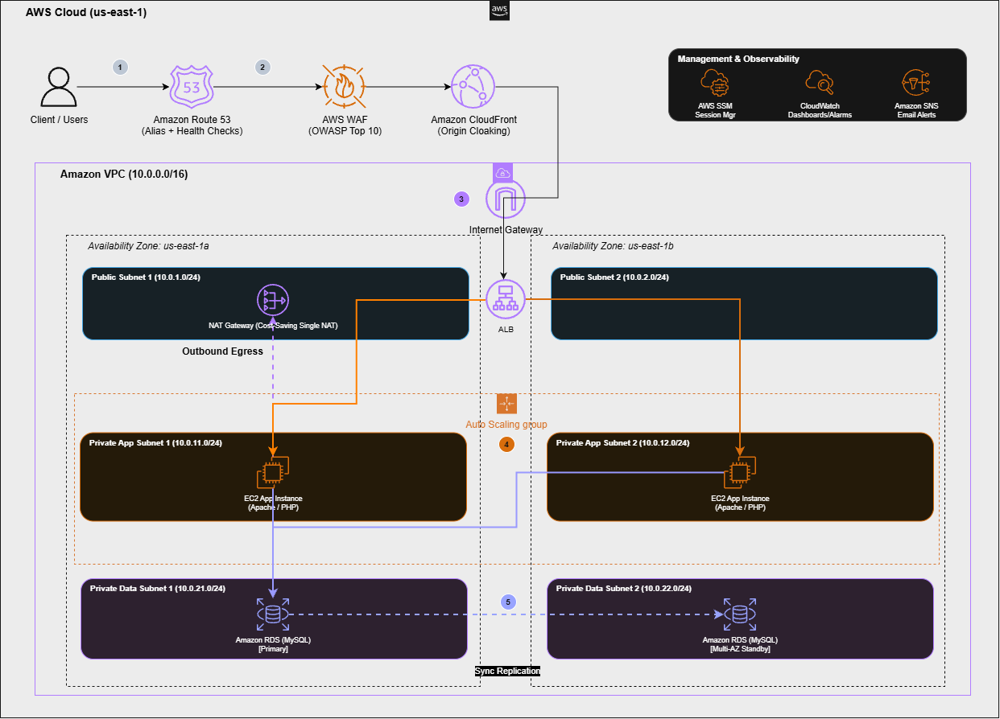

# Production-Grade Highly Available 3-Tier Web Architecture on AWS

[](deployment/cloudformation/production-3tier-architecture.yaml)
[](#architecture-diagram--traffic-flow)
[](docs/security.md)
[](docs/security.md#2-origin-cloaking-cloudfront-shielding)
[](docs/operations.md#database-tier-multi-az-rds)
[](docs/operations.md#cost-optimization-strategy-100-budget)
[](LICENSE)

An enterprise-ready, cost-engineered 3-tier web architecture deployed in AWS using AWS CloudFormation. This production blueprint demonstrates end-to-end defense-in-depth, Multi-AZ resilience across compute and database tiers, zero-bastion fleet management via AWS Systems Manager, origin cloaking, and observability with Amazon CloudWatch and SNS.

> 🔴 **Live Demo**: [https://d1topmc0acns1k.cloudfront.net/](https://d1topmc0acns1k.cloudfront.net/) — the deployed application, live. *(Note: the custom domain `app.production-aws-lab.com` is fully configured via Route 53 alias but not yet publicly resolvable, as the domain has not been purchased — use the CloudFront URL above to access the live app).*

---

## Documentation Suite

To maintain modularity and high scannability, detailed architectural specifications and operational runbooks are organized into focused guides:

| Document | Focus & Coverage |
| :--- | :--- |
| 🌐 [**VPC & Network Topology**](docs/network.md) | Subnet allocation matrix, CIDR blocks, route tables, and Single-AZ NAT Gateway trade-off analysis. |
| 🛡️ [**Security Architecture & Origin Cloaking**](docs/security.md) | Defense-in-depth, security group chaining, ALB prefix list isolation, IMDSv2, and AWS WAF rule sets. |
| ⚙️ [**System Operations & Runbook**](docs/operations.md) | Auto Scaling, Multi-AZ RDS, CloudWatch dashboards & alarms, operational test commands, and teardown. |
| 📊 [**Verified Deliverables & Evidence Archive**](docs/evidence.md) | Live deployment evidence, terminal verification sessions, Route 53 health probing, and WAF testing. |
| 🏛️ [**AWS Well-Architected Alignment**](docs/well-architected.md) | Deep evaluation across all six Well-Architected Framework pillars. |

---

## Solution Overview

This solution deploys a production-grade 3-tier web architecture hosting dynamic Apache and PHP workloads backed by an Amazon RDS MySQL database. The infrastructure spans two Availability Zones (`us-east-1a` and `us-east-1b`) to ensure continuous uptime during single-zone disruptions or maintenance windows.

### Core Architectural Highlights
- **Resilient Multi-AZ Compute**: Auto Scaling Group dynamically managing EC2 instances in private subnets across two AZs with automatic health checks and target tracking scaling.
- **Zero-Bastion Fleet Management**: Administrative access is brokered strictly through AWS Systems Manager (SSM) Session Manager. SSH port 22 is disabled across all security groups, eliminating external attack vectors.
- **Perimeter Defense & Origin Cloaking**: Amazon CloudFront terminates client TLS and caches content at edge locations. AWS WAF inspects incoming requests against OWASP Top 10 vulnerabilities. The Application Load Balancer (ALB) enforces origin cloaking via the CloudFront Origin-Facing Managed Prefix List, rejecting direct bypass attempts.
- **Isolated Multi-AZ Data Layer**: Amazon RDS MySQL operates with synchronous replication between primary (`us-east-1a`) and standby (`us-east-1b`) instances. The database resides in isolated subnets with no internet gateways or NAT routes.
- **Proactive Observability**: Amazon CloudWatch dashboard displays end-to-end metrics (ALB requests, latency, ASG CPU utilization, and RDS health) alongside automated CloudWatch Alarms integrated with Amazon SNS email notifications.
- **Cost Engineered (<$100 Lab Budget)**: Utilizes a Single-AZ NAT Gateway routing pattern, burstable `t3.micro` and `db.t3.micro` instances, and targeted AWS WAF rule bundles to maximize security while keeping monthly expenditure well within lab constraints.

---

## Architecture Diagram & Traffic Flow

The architecture implements physical separation between tiers across two Availability Zones, with inbound access flowing strictly through edge defenses.



### End-to-End Traffic Walkthrough

```text
[Client / Users]
       │ (1) DNS Resolution & Global Edge Health Checks
       ▼
[Amazon Route 53] (app.production-aws-lab.com -> CloudFront Alias)
       │
       ▼
[AWS WAF] (OWASP Top 10, Bad Inputs, IP Reputation)
       │ (2) Layer 7 Request Inspection & Filtering
       ▼
[Amazon CloudFront] (d1topmc0acns1k.cloudfront.net)
       │ (3) Global Edge Caching & Origin Cloaked Egress
       ▼
[Amazon VPC (10.0.0.0/16)] ─── [Internet Gateway]
       │
       ▼
[Application Load Balancer: prod-web-alb] (Public Subnets 10.0.1.0/24 & 10.0.2.0/24)
       │ (4) Round-Robin Reverse Proxy to Private Compute
       ┌───────────────────────────────────────────┴───────────────────────────────────────────┐
       ▼                                                                                       ▼
[Private App Subnet 1a]                                                   [Private App Subnet 1b]
  EC2 App Instance (Apache/PHP)                                             EC2 App Instance (Apache/PHP)
  Subnet: 10.0.11.0/24                                                      Subnet: 10.0.12.0/24
       │                                                                                       │
       │ (5) MySQL 3306 Query Traffic                                                          │
       └───────────────────────────────────┬───────────────────────────────────────────────────┘
                                           ▼
                              [Private DB Subnets 1a & 1b]
                              Primary RDS MySQL (10.0.21.0/24)
                                     │
                                     │ Synchronous Replication
                                     ▼
                              Standby RDS MySQL (10.0.22.0/24)
```

1. **Step 1: DNS Resolution & Edge Probing**: Users resolve `app.production-aws-lab.com` through Amazon Route 53, which uses an Alias A record pointing directly to CloudFront. Simultaneously, Route 53 Global Health Checks probe the endpoint across 8 international locations.
2. **Step 2: Layer 7 Perimeter Inspection**: Requests pass through AWS WAF attached to CloudFront. Pre-configured managed rule sets evaluate headers and payloads for SQL Injection, Cross-Site Scripting (XSS), bad inputs, and known malicious IPs before requests can proceed.
3. **Step 3: Edge Caching & Origin Cloaked Transit**: CloudFront serves cached assets from edge PoPs. For cache misses or dynamic content, CloudFront routes traffic to the origin ALB. Traffic is verified against the CloudFront Origin-Facing Managed Prefix List.
4. **Step 4: Load Balancing to Private Compute**: The ALB terminates client connections and distributes requests across EC2 instances provisioned in private subnets across `us-east-1a` and `us-east-1b`. Instances process the dynamic PHP application and fetch local metadata via IMDSv2.
5. **Step 5: Secure Multi-AZ Data Persistence**: Application instances communicate over port 3306 with the primary Amazon RDS MySQL instance. Synchronous data replication continuously mirrors state to the Multi-AZ standby replica in the secondary AZ.
6. **Out-of-Band Management & Observability**: Systems administrators access private EC2 instances without bastion hosts or SSH keys using AWS Systems Manager Session Manager. Operational metrics flow into Amazon CloudWatch, triggering SNS email notifications upon anomalous conditions.

---

## Quickstart Deployment Guide

> [!NOTE]
> **Note on Deployment Method**: The live environment referenced throughout this documentation and the Evidence Archive was originally provisioned manually via the AWS Console, then brought under CloudFormation management using AWS's IaC Generator — see `deployment/cloudformation/production-3tier-architecture.generated.yaml` for an authoritative snapshot of the actual deployed resources. A separate, parameterized template (`deployment/cloudformation/production-3tier-architecture.yaml`, used in the steps below) is provided for deploying a fresh instance of this architecture in a new AWS account or region; it has been validated with `cfn-lint` and cross-checked for consistency against the generated template, though it has not yet been deployed end-to-end from a clean environment.

### Prerequisites
- AWS Account with Administrator or PowerUser IAM permissions.
- [AWS CLI v2](https://aws.amazon.com/cli/) installed and configured (`aws configure`).
- An active Route 53 Public Hosted Zone for custom domain routing.

### Step 1: Clone the Repository
```bash
git clone https://github.com/fouad-awad/production-aws-3tier-web-app.git
cd production-aws-3tier-web-app
```

### Step 2: Deploy Infrastructure via AWS CloudFormation
Deploy the core networking, security groups, database, compute fleet, load balancer, edge WAF, health checks, and alarms:

```bash
aws cloudformation deploy \
  --template-file deployment/cloudformation/production-3tier-architecture.yaml \
  --stack-name production-3tier-web-stack \
  --parameter-overrides \
      VpcCIDR=10.0.0.0/16 \
      DBUsername=admin \
      DBPassword="YOUR_SECURE_PASSWORD" \
      AlertEmail="admin@yourdomain.com" \
  --capabilities CAPABILITY_NAMED_IAM
```

### Step 3: Create the CloudFront Distribution & Attach the Provisioned WAF
1. Create a CloudFront Distribution pointing to the `ALBDNSName` output from the CloudFormation stack.
2. The AWS WAF Web ACL (with `AWSManagedRulesCommonRuleSet`, `AWSManagedRulesKnownBadInputsRuleSet`, and `AWSManagedRulesAmazonIpReputationList`) is created automatically by the stack — retrieve its ARN from the `WebACLArn` stack output.
3. Associate the Web ACL with the CloudFront distribution by setting the distribution's `WebACLId` property to the `WebACLArn` output value (CloudFront associates WAF via this property rather than a separate association resource).

### Step 4: Configure the Route 53 DNS Alias
1. In your Route 53 Hosted Zone, create an Alias A record pointing `app.production-aws-lab.com` to the CloudFront distribution's domain name.
2. The global health check (monitoring the CloudFront domain over HTTPS across 8 regions, 30-second interval) is created automatically by the stack — retrieve its ID from the `Route53HealthCheckId` stack output if you need to reference it (e.g., to attach it to the DNS record's health-check-based routing policy).

*For complete operational validation, testing commands, and teardown steps, consult the [**System Operations & Runbook**](docs/operations.md).*

---

## Known Limitations & Production Roadmap

This solution was engineered as a high-fidelity, cost-constrained MVP (<$100/month budget). The following limitations are acknowledged, with clear upgrade paths for unconstrained production environments:

- **Infrastructure CI/CD**: Changes are deployed manually via `aws cloudformation deploy`. A mature production pipeline would implement GitHub Actions or AWS CodePipeline with automated linting (`cfn-lint`), security static analysis (`cfn-nag`, Checkov), and pull-request change-set preview diffs.
- **Database Credential Secrets Management**: Master credentials are provided at stack launch as CloudFormation parameters. A production release would integrate with AWS Secrets Manager (`ManageMasterUserPassword`) for native secret creation and automatic credential rotation.
- **Disaster Recovery Beyond Multi-AZ**: Resiliency is scoped to single-region Multi-AZ failover. Full enterprise business continuity would establish formal RTO and RPO metrics, automated AWS Backup vault replication across a secondary AWS region, and cross-region Read Replicas.
- **Backup Retention Period**: The RDS instance currently retains automated backups for only 1 day. A production deployment should extend this to 7–35 days depending on recovery point objectives, and pair it with the cross-region backup strategy already noted under Disaster Recovery above.
- **AMI Lifecycle & Patch Management**: Compute nodes run a static Amazon Linux 2023 AMI declared in the template. An automated pipeline would use EC2 Image Builder with daily CVE scanning and automated ASG instance refreshes for zero-downtime base-image updates.
- **Application Deployment Strategy**: New software versions deploy via EC2 launch template updates. High-traffic production would adopt Canary or Blue/Green deployment mechanisms (e.g., CodeDeploy or containerization via Amazon ECS/EKS) with automated rollback triggers.
- **AWS WAF Telemetry Depth**: WAF collects aggregated CloudWatch metric counters. Forensic security investigations require enabling full AWS WAF request logging routed to Amazon Kinesis Data Firehose with Amazon S3 or OpenSearch storage.
- **Single-AZ NAT Gateway Egress**: Egress routing relies on a single NAT Gateway (`prod-web-nat-1a`). Production systems require a dual NAT Gateway design (`prod-web-nat-1a` and `prod-web-nat-1b`) for complete AZ-level fault domain isolation.

---

## License

This project is open-source and licensed under the [Apache 2.0 License](LICENSE).
