# Verified Deliverables & Empirical Evidence Archive

> [!IMPORTANT]
> **Evidence Status: Verified Live**  
> **Last Verified Date**: `September 20, 2026`  
> All test runs, terminal sessions, metrics, and screenshots in this document were captured directly from the live AWS environment (`production-3tier-web-stack`, `us-east-1`).

---

### Deliverable 1: Solution Architecture Diagram
High-resolution 3-tier architecture diagram displaying multi-AZ subnets, Auto Scaling boundary, origin cloaking, and numbered workflow steps (1-5).


---

### Deliverable 2: Route 53 DNS Configuration
Route 53 Public Hosted Zone (`app.production-aws-lab.com`) routing traffic via an Alias A record directly to CloudFront (`d1topmc0acns1k.cloudfront.net`).

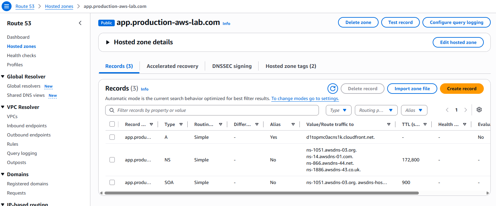

---

### Deliverable 3: Route 53 Global Health Probing
Route 53 Health Check (`prod-edge-health-check`) actively monitoring the HTTPS endpoint every 30 seconds, reporting healthy (HTTP 200 OK) status across all 8 international edge regions.

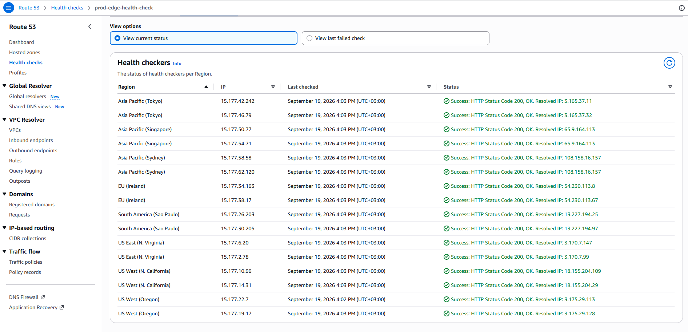

---

### Deliverable 4: AWS WAF Layer 7 Interception & Managed Rules
Testing the CloudFront endpoint with an injected Cross-Site Scripting (XSS) payload demonstrates automated blocking by AWS WAF:
```bash
curl -I "https://d1topmc0acns1k.cloudfront.net/?test=<script>alert(1)</script>"
```
The request is blocked at the edge with an `HTTP/2 403 Forbidden` response from CloudFront without reaching the origin ALB.

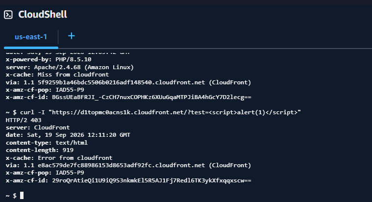

#### AWS WAF Managed Rule Sets Configuration
Web ACL `prod-web-waf` configured with active AWS Managed Rule Sets (`AWS-AWSManagedRulesCommonRuleSet`, `AWS-AWSManagedRulesKnownBadInputsRuleSet`, and `AWS-AWSManagedRulesAmazonIPReputationList`) inspecting requests in ascending priority order:


---

### Deliverable 5: ALB Origin Cloaking Verification
Direct access to the public Application Load Balancer DNS is blocked by the ALB security group, which enforces the CloudFront Origin-Facing Managed Prefix List:
```bash
curl -I -m 5 http://prod-web-alb-794434403.us-east-1.elb.amazonaws.com
```
The connection times out after 5000 milliseconds, confirming complete isolation from direct internet bypass.

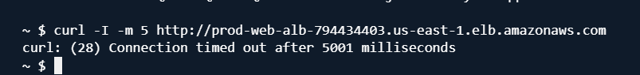

---

### Deliverable 6: Auto Scaling Group & Multi-AZ Compute
The Application Load Balancer successfully balances incoming requests across healthy EC2 instances running in separate Availability Zones:
- Response 1 served from instance `i-07d1eed378b003007` in `us-east-1a`.
- Response 2 served from instance `i-0be48c2faa91d94e2` in `us-east-1b`.

| Response from AZ 1a (`us-east-1a`) | Response from AZ 1b (`us-east-1b`) |
| :---: | :---: |
| 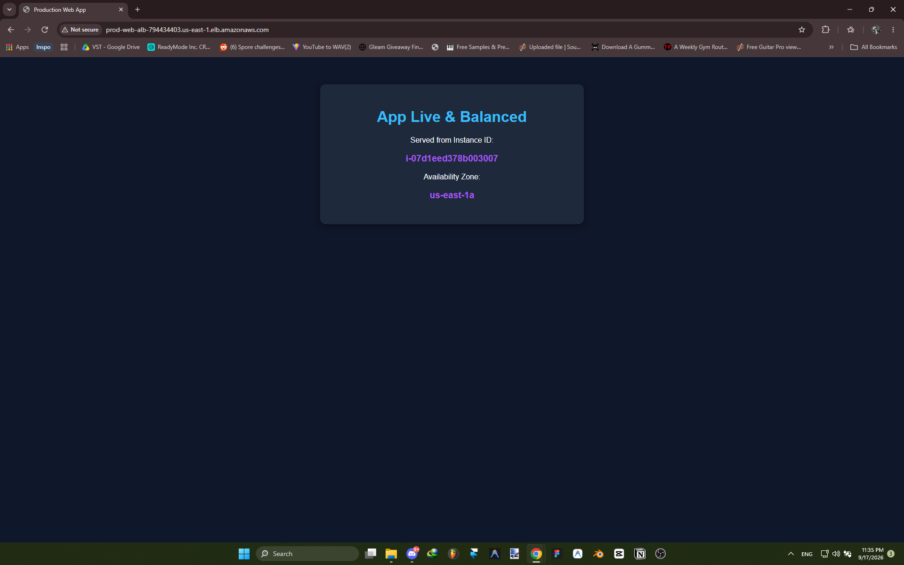 | 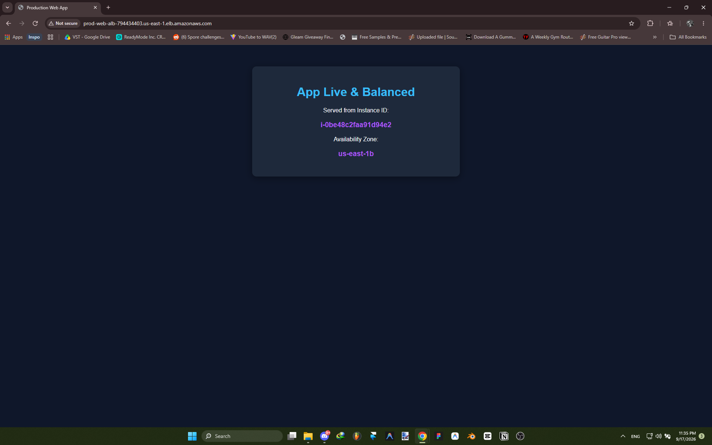 |

#### Launch Template Configuration (`web-app-template`)
Launch template configuration enforcing IMDSv2 (`HttpTokens: required`), IAM role assignment, and zero key pairs.

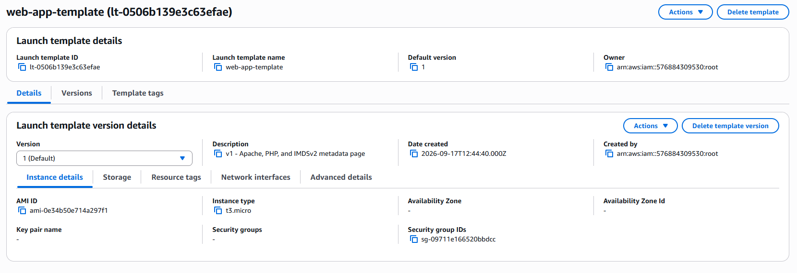

---

### Deliverable 7: Amazon RDS Multi-AZ Topology & Verification
Amazon RDS MySQL instance (`prod-web-db`) configured with Multi-AZ synchronous replication:
```bash
aws rds describe-db-instances \
  --db-instance-identifier prod-web-db \
  --query "DBInstances[0].{Status:DBInstanceStatus, MultiAZ:MultiAZ, PrimaryAZ:AvailabilityZone, SecondaryAZ:SecondaryAvailabilityZone}" \
  --output table
```
CLI output verifies `MultiAZ: True`, Primary node in `us-east-1a`, and Standby replica in `us-east-1b`.

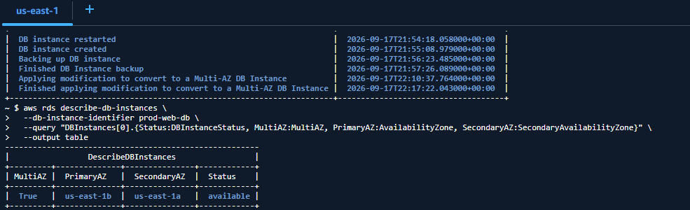

#### Database Multi-AZ Conversion Events
RDS event logs confirming successful automated conversion and snapshot creation for Multi-AZ operation.

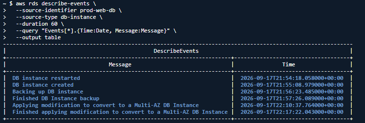

#### End-to-End Private EC2 to RDS Connectivity
Connecting from a private application instance (`10.0.12.87`) to the MySQL RDS endpoint via the MySQL client, verifying authorized SQL access over port 3306.

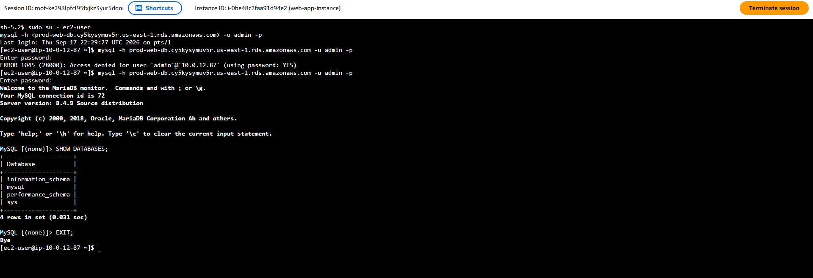

---

### Deliverable 8: Bastionless Systems Manager (SSM) Access
Secure shell session (`root-cqf3n8tqjypdoopxox4dotan6q`) initiated via AWS Systems Manager Session Manager into private instance `i-0be48c2faa91d94e2` without public IPs or open SSH ports.

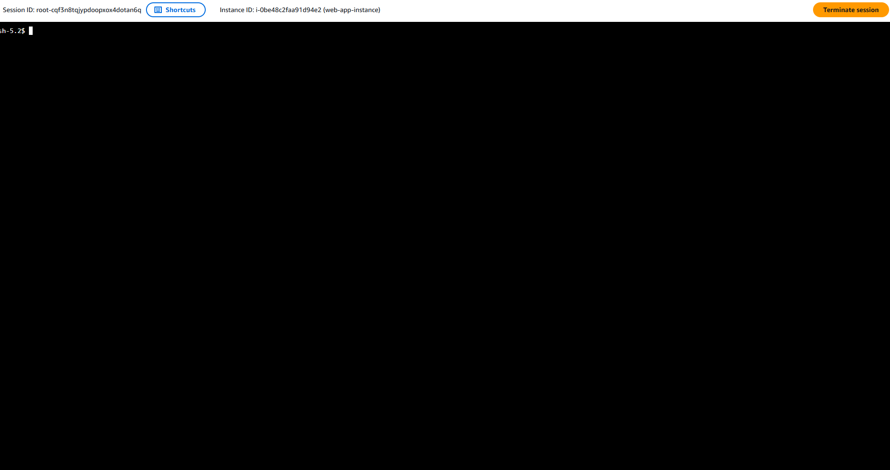

---

### Deliverable 9: CloudWatch Operational Dashboard
Single-pane operations view displaying live alarm status banners, ALB throughput, target response times, ASG CPU utilization, and RDS database metrics.


---

### Deliverable 10: Amazon SNS Alert Subscription
Amazon SNS console showing confirmed email subscription for topic `prod-web-alerts-topic`.

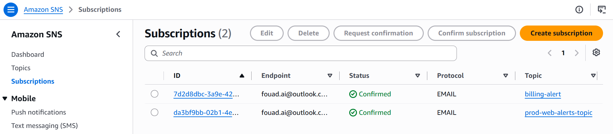

---

### Deliverable 11: CloudWatch Metric Alarms
Top operational health status banner showing all three core alarms (`prod-asg-high-cpu-utilization`, `prod-edge-healthcheck-failed`, and `prod-web-alb-high-5xx-errors`) in healthy OK status.


---

### Additional Verified Supporting Evidence

#### VPC Resource Map & Routing Breakdown
Visual resource map of VPC `prod-web-vpc` demonstrating 6 subnets, 4 route tables, Internet Gateway, and Single NAT Gateway.

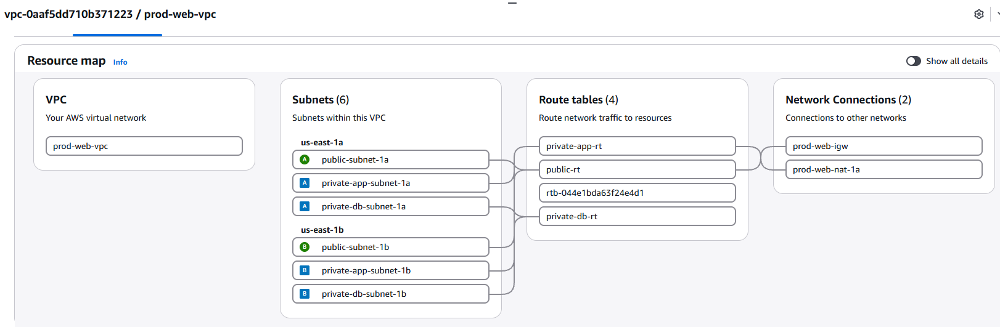

| Public Route Table (`public-rt`) | Private App Route Table (`private-app-rt`) | Private DB Route Table (`private-db-rt`) |
| :---: | :---: | :---: |
| 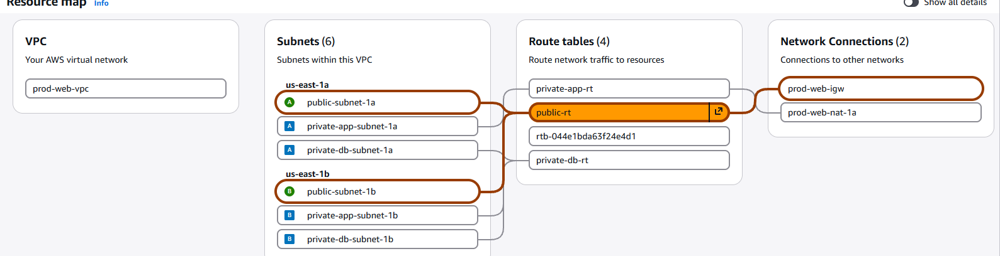 | 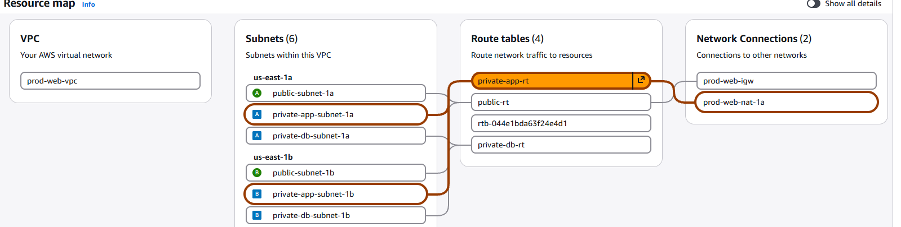 | 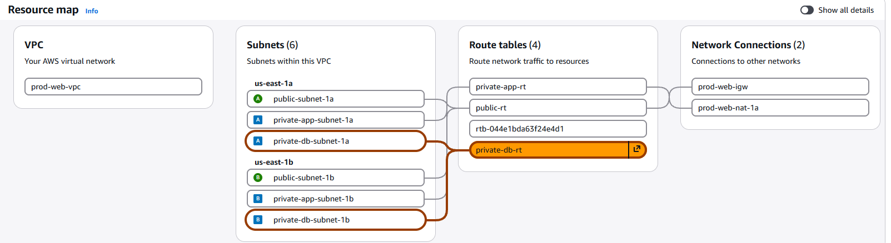 |

#### Security Group Ingress Chaining
Strict least-privilege chaining from ALB to EC2 to RDS.

| ALB Security Group (`alb-sg`) | EC2 Web Security Group (`ec2-web-sg`) | RDS DB Security Group (`rds-db-sg`) |
| :---: | :---: | :---: |
| 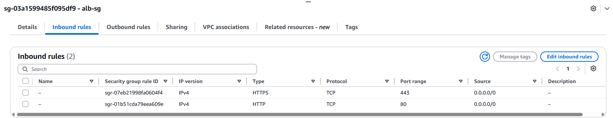 | 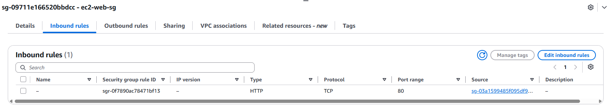 | 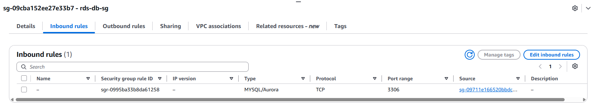 |

#### CloudFront Distribution & Edge SSL
CloudFront distribution `prod-web-cf` serving HTTPS traffic globally with AWS WAF enabled.

| CloudFront Distribution Security | Live HTTPS App via CloudFront |
| :---: | :---: |
| 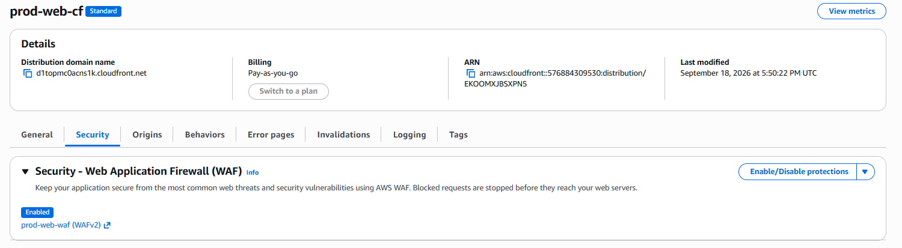 | 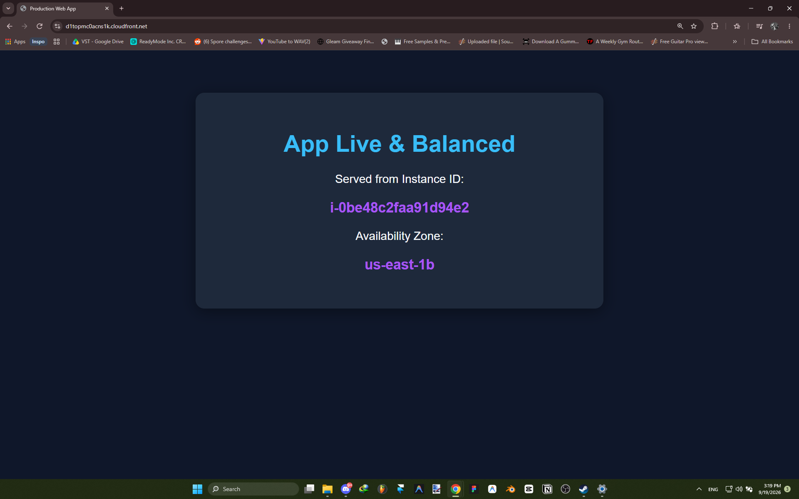 |

#### AWS WAF Web ACL & Managed Rule Sets
AWS WAF Web ACL (`prod-web-waf`) with active AWS Managed Rule Sets inspecting incoming traffic in priority order.


---

[← Return to README](../README.md)
