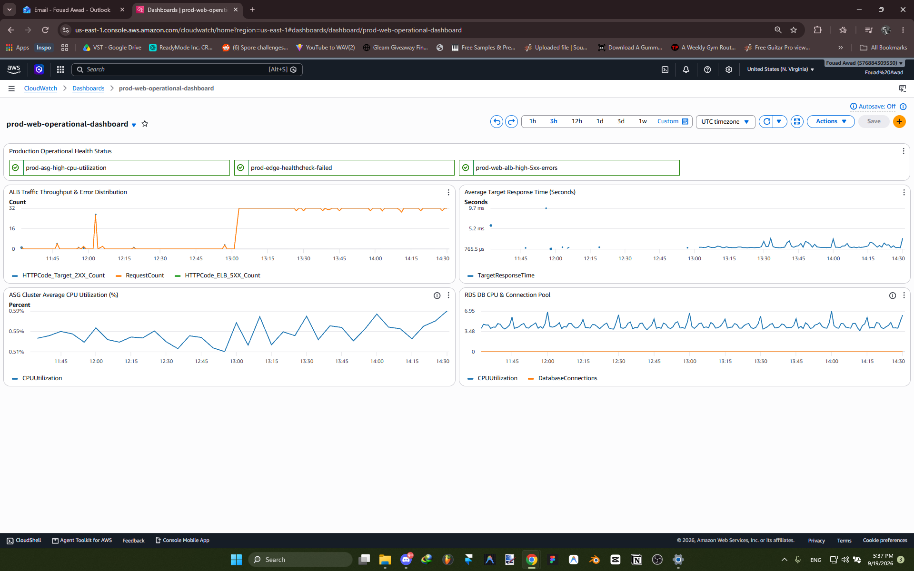

# System Operations, Compute, Database & Monitoring

Comprehensive operational runbook covering compute elasticity, database administration, monitoring telemetry, cost optimization, operational validation, and infrastructure teardown.

---

## Compute & Auto Scaling Tier

The compute layer is engineered for elasticity and high availability.

- **Auto Scaling Group (`web-app-asg`)**:
  - Capacity: Desired: 2, Min: 2, Max: 4.
  - Subnet Distribution: Spread across `private-app-subnet-1a` and `private-app-subnet-1b`.
  - Health Check Type: Elastic Load Balancing (`ELB`) with a 300-second grace period.
- **Launch Template (`web-app-template` / `lt-0506b139e3c63efae`)**:
  - AMI: Amazon Linux 2023 (`ami-0e34b50e714a297f1`).
  - Instance Type: `t3.micro` (2 vCPU, 1 GiB RAM).
  - Key Pair: None (enforcing bastion-free SSM access).
  - IAM Profile: `prod-ec2-ssm-instance-profile`.
- **Target Tracking Scaling Policy**:
  - Metric: `ASGAverageCPUUtilization` maintained at 70%.
  - Warmup Period: 300 seconds.

---

> [!NOTE]
> **Production Note — Burstable Instance Classes (`t3.micro` / `db.t3.micro`)**:  
> Both the web application fleet (`t3.micro`) and the database (`db.t3.micro`) utilize burstable T-series instance types. This decision aligns baseline resource allocation with predictable lab traffic patterns while allowing automatic CPU credit accumulation for brief bursts.  
>  
> Under sustained production load, CPU credit depletion leads to severe throttling down to baseline capacity (10–20% of vCPU), resulting in elevated response times and database query queuing. A production deployment would:
> - Enable T3 Unlimited mode as an intermediate burst safety net.
> - Migrate production compute and database tiers to general-purpose (`m7g`/`m6i`) or memory-optimized (`r7g`/`r6i`) instance families with dedicated vCPUs.
> - Conduct empirical synthetic load testing (e.g., using Locust or k6) to right-size instance capacity based on peak requests per second (RPS) and memory footprints.

---

## Database Tier (Multi-AZ RDS)

- **Database Engine**: Amazon RDS for MySQL (Engine version: `8.4.9`).
- **Instance Class**: `db.t3.micro` with General Purpose SSD (`gp2`) storage.
- **Backup Retention Period**: 1 day of automated daily backups and point-in-time recovery (`BackupRetentionPeriod: 1`).
- **Multi-AZ Deployment**: Enabled (`MultiAZ: True`).
  - **Primary Node**: Deployed in `us-east-1a` handling active read and write operations.
  - **Standby Replica**: Deployed in `us-east-1b` receiving continuous synchronous replication.
- **Automated Failover**: In the event of primary instance failure or AZ degradation, RDS automatically updates DNS records to promote the standby replica to primary with zero manual intervention.
- **Network Isolation**: Deployed in `prod-web-db-subnet-group` spanning `private-db-subnet-1a` and `private-db-subnet-1b`. `PubliclyAccessible` is set to `false`.

---

## Observability & Operational Monitoring

A single-pane-of-glass operations architecture provides visibility into infrastructure health.



### 1. Single-Pane CloudWatch Dashboard (`prod-web-operational-dashboard`)
The dashboard aggregates operational telemetry across all tiers:
- **Production Operational Health Status**: Top banner showing live alarm states for all core thresholds.
- **ALB Traffic Throughput & Error Distribution**: Tracks `RequestCount`, `HTTPCode_Target_2XX_Count`, and `HTTPCode_ELB_5XX_Count`.
- **Average Target Response Time**: Real-time ELB latency metrics (consistently sub-5ms).
- **Compute Auto Scaling Performance**: Real-time aggregate ASG CPU utilization (`prod-asg-high-cpu-utilization`).
- **Database Health & Capacity**: Tracks RDS CPU Utilization, free storage space, and database connection counts.

### 2. CloudWatch Metric Alarms & SNS Alerting
Automated alerts publish directly to `prod-web-alerts-topic` with email delivery:

| Alarm Name | Monitored Metric | Threshold Condition | Evaluation Period | Action |
| :--- | :--- | :--- | :--- | :--- |
| `prod-asg-high-cpu-utilization` | `CPUUtilization` (ASG) | > 80% | 2 consecutive periods (10 min) | Notify SNS Alert Topic |
| `prod-edge-healthcheck-failed` | `HealthCheckStatus` (Route 53) | < 1 (Failed) | 1 period (1 min) | Notify SNS Alert Topic |
| `prod-web-alb-high-5xx-errors` | `HTTPCode_ELB_5XX_Count` | > 5 errors | 1 period (5 min) | Notify SNS Alert Topic |

---

## Cost-Optimization Strategy (<$100 Budget)

Engineered specifically to demonstrate production capabilities under a constrained lab budget (<$100/month).

| Service | Architecture Role | Sizing / Configuration | Estimated Monthly Cost |
| :--- | :--- | :--- | :--- |
| **NAT Gateway** | Outbound Egress | 1x Single-AZ Gateway (`public-subnet-1a`) | ~$32.40 / month |
| **EC2 Instances** | Compute Fleet | 2x `t3.micro` (Burst-capable) | ~$15.00 / month |
| **Amazon RDS** | Data Layer | Multi-AZ `db.t3.micro` (gp3) | ~$19.80 / month |
| **ALB** | Load Balancing | 1x Application Load Balancer | ~$16.20 / month |
| **AWS WAF** | Perimeter Security | Web ACL + 3 Managed Rules | ~$6.00 / month |
| **Route 53** | DNS & Health Check | 1 Hosted Zone + Global Health Check | ~$1.25 / month |
| **CloudFront** | Edge CDN | Global Free-Tier Allowance (1 TB egress) | Free Tier ($0.00) |
| **SSM Session Manager** | Fleet Management | Bastionless Direct Agent Access | Included ($0.00) |
| **Total Estimated Run-Rate** | | | **~$84.50 / month** |

### Key Cost Optimizations
1. **Single-AZ NAT Gateway**: Saves ~$32.40/month by avoiding redundant NAT gateways across secondary AZs. *(See [VPC & Network Topology](network.md) for production trade-off analysis)*.
2. **Right-Sized Burstable Compute**: Deploying `t3.micro` EC2 instances and `db.t3.micro` RDS instances provides sufficient baseline performance with CPU credit bursting while remaining within free-tier or micro-tier pricing. *(See Production Note above)*.
3. **Targeted WAF Rule Selection**: Using a custom-built Web ACL bundle with AWS Managed Rules ($14/10M requests) instead of comprehensive pre-packaged bundles ($43-$59/month) delivers OWASP Top 10 protection at a fraction of the cost. *(See [Security Architecture](security.md) for production trade-off analysis)*.
4. **Bastion-Free Design**: Eliminates the dedicated EC2 instance, Elastic IP, and maintenance charges associated with traditional bastion jump hosts.

---

## Verification & Operational Testing

### 1. Test ALB Load Balancing & Round-Robin Routing
```bash
# Query the CloudFront endpoint multiple times to verify traffic distribution
for i in {1..4}; do curl -s https://app.production-aws-lab.com | grep "Server IP"; done
```

### 2. Verify Origin Cloaking (ALB Direct Ingress Drop)
```bash
# Attempt to reach the ALB DNS directly (must time out)
curl -I -m 5 http://prod-web-alb-794434403.us-east-1.elb.amazonaws.com
# Expected output: curl: (28) Connection timed out after 5000 milliseconds
```

### 3. Verify AWS WAF Layer 7 XSS Protection
```bash
# Send an XSS probe to verify WAF interception
curl -I "https://app.production-aws-lab.com/?test=<script>alert(1)</script>"
# Expected output: HTTP/2 403 Forbidden
```

### 4. Connect to Private EC2 via AWS Systems Manager
```bash
# Connect securely without SSH keys or open port 22
aws ssm start-session --target <INSTANCE-ID>
```

### 5. Verify Database Connectivity from Private App Tier
```bash
# Run SQL verification
mysql -h prod-web-db.c7y8w0ek6v0t.us-east-1.rds.amazonaws.com -u admin -p
SELECT @@hostname, @@version;
```

---

## Teardown & Clean Up

To avoid ongoing AWS charges after evaluation:

```bash
# 1. Delete CloudFront Distribution (Disable first, then delete)
# Set Enabled to false, update distribution, wait for Deployed, then:
aws cloudfront delete-distribution --id <CF-DIST-ID> --if-match <ETAG>

# 2. Delete AWS WAF Web ACL
aws wafv2 delete-web-acl --name prod-web-waf --scope CLOUDFRONT --id <WAF-ID> --lock-token <TOKEN> --region us-east-1

# 3. Delete Route 53 Records and Health Check
aws route53 delete-health-check --health-check-id <HEALTH-CHECK-ID>
aws route53 change-resource-record-sets --hosted-zone-id <ZONE-ID> --change-batch file://delete-records.json

# 4. Delete the CloudFormation Stack
aws cloudformation delete-stack --stack-name production-3tier-web-stack

# 5. Confirm Stack Deletion
aws cloudformation wait stack-delete-complete --stack-name production-3tier-web-stack
```

---

[← Return to README](../README.md)
