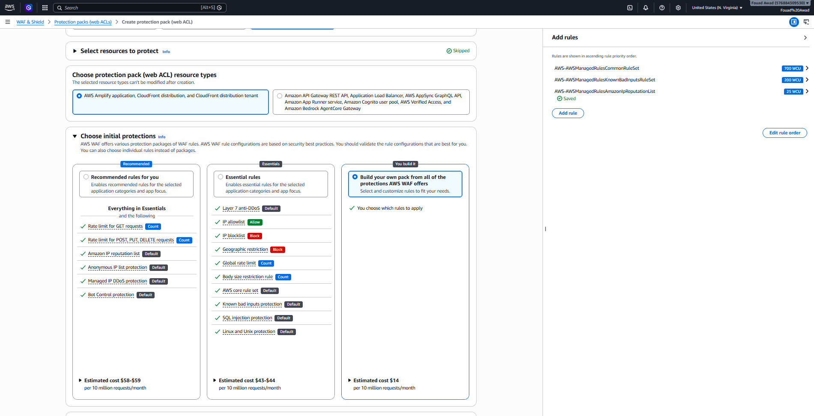

# Security Architecture & Origin Cloaking

Defense-in-depth is enforced at the DNS, edge, network, host, and database layers through least-privilege security group chaining, origin cloaking, IMDSv2, and managed web application filtering.

```text
[Internet / Client]
       │ HTTPS (443)
       ▼
[Amazon CloudFront + AWS WAF]
       │ Verified Prefix List Only (Port 80/443)
       ▼
[Security Group: alb-sg]
       │ Reverse Proxy HTTP (Port 80)
       ▼
[Security Group: ec2-web-sg]
       │ MySQL Traffic Only (Port 3306)
       ▼
[Security Group: rds-db-sg]
```

---

## 1. Security Group Chaining Matrix

| Security Group | Attached Resource | Direction | Protocol | Port Range | Source / Destination | Security Rationale |
| :--- | :--- | :--- | :--- | :--- | :--- | :--- |
| **`alb-sg`** | Application Load Balancer | Inbound | TCP | 80, 443 | `com.amazonaws.global.cloudfront.origin-facing` | Restricts incoming traffic exclusively to CloudFront PoPs (Origin Cloaking). Direct public traffic times out. |
| **`alb-sg`** | Application Load Balancer | Outbound | TCP | 80 | `ec2-web-sg` | Permits reverse-proxy forwarding exclusively to the private web application instances. |
| **`ec2-web-sg`** | Auto Scaling EC2 Fleet | Inbound | TCP | 80 | `alb-sg` | Authorizes web traffic originating strictly from the ALB. Direct connections are dropped. |
| **`ec2-web-sg`** | Auto Scaling EC2 Fleet | Outbound | TCP | 3306 | `rds-db-sg` | Permits database queries strictly to the authorized database security group. |
| **`rds-db-sg`** | RDS Multi-AZ Database | Inbound | TCP | 3306 | `ec2-web-sg` | Allows database connections exclusively from application instances. No public or bastion access. |
| **`rds-db-sg`** | RDS Multi-AZ Database | Outbound | - | - | None | Database instances cannot initiate outbound external traffic. |

---

## 2. Origin Cloaking (CloudFront Shielding)
To prevent attackers from bypassing CloudFront and AWS WAF by sending direct HTTP requests to the public ALB DNS (`prod-web-alb-794434403.us-east-1.elb.amazonaws.com`), the ALB security group restricts ingress to the AWS CloudFront Origin-Facing Managed Prefix List. Any direct curl or browser request attempting to reach the ALB directly times out after 5 seconds (`curl: (28) Connection timed out`).

---

## 3. Zero-Bastion Management (AWS Systems Manager)
Traditional bastion hosts introduce maintenance overhead, public IP exposure, and SSH key management challenges. In this architecture:
- SSH port 22 is closed across all security groups.
- No EC2 instances have public IP addresses assigned.
- EC2 instances assume an IAM role with the `AmazonSSMManagedInstanceCore` managed policy.
- Engineers connect directly to private instances via browser-based or CLI-based AWS Systems Manager Session Manager sessions, with full session logging and auditability.

---

## 4. Instance Metadata Service Version 2 (IMDSv2)
To mitigate SSRF (Server-Side Request Forgery) vulnerabilities and credential exfiltration, the EC2 Launch Template enforces IMDSv2 (`HttpTokens: required`). Metadata requests require a signed session token created via an HTTP `PUT` request with an expiration header.

---

## 5. AWS WAF Layer 7 Filtering
AWS WAF is attached directly to the Amazon CloudFront distribution, evaluating incoming requests using AWS Managed Rule Sets:
- **`AWSManagedRulesCommonRuleSet`**: Baseline protection against common web threats including OWASP Top 10 risks.
- **`AWSManagedRulesKnownBadInputsRuleSet`**: Blocks request patterns known to exploit application vulnerabilities or invalid request formats.
- **`AWSManagedRulesAmazonIpReputationList`**: Intercepts requests from IP addresses associated with botnets and reconnaissance activity.



---

> [!NOTE]
> **Production Note — Custom WAF Rule Bundle vs. Pre-Packaged Bundles**:  
> AWS WAF protections are configured using a custom Web ACL composed of three foundational AWS Managed Rule Groups (`AWSManagedRulesCommonRuleSet`, `AWSManagedRulesKnownBadInputsRuleSet`, and `AWSManagedRulesAmazonIpReputationList`). This targeted selection provides critical OWASP Top 10 mitigation and IP reputation filtering at ~$14 per 10 million requests, compared to pre-packaged comprehensive bundles that cost $43–$59/month.  
>  
> The architectural trade-off is a narrower signature footprint out of the box. A comprehensive enterprise production policy would augment this baseline with:
> - Rate-based rules to throttle volumetric HTTP floods and brute-force probing.
> - AWS WAF Bot Control and Account Takeover Prevention (ATP) managed rule sets.
> - Comprehensive SQLi/POSIX Regex rules tailored to deep application payloads.

---

[← Return to README](../README.md)
